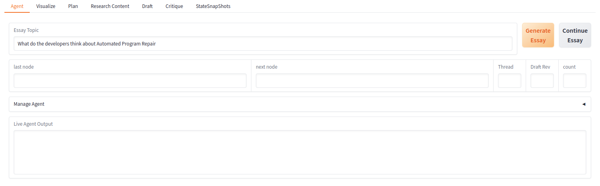
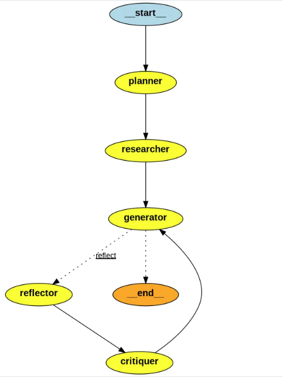

# Multi-Agent Writer

## Description
Multi-Agent Writer is a sophisticated tool designed to assist in generating and managing content through multiple agents. This project leverages GPT-4o capabilities to streamline the research and writing process, making it efficient and effective.

## Installation

1. Clone the repository:
    ```bash
    git clone https://github.com/yourusername/multi-agent-writer.git
    cd multi-agent-writer
    ```

2. Install the required dependencies:
    ```bash
    pip install -r requirements.txt
    ```

3. Set up environment variables:
    - Create an `.env` 
    - Add `GITHUB_TOKEN` from Azure Marketplace for prototyping.
    - Add `Tavily_API_TOKEN` in the `.env` file.

4. Run the application:
    ```bash
    python main.py
    ```

## GUI Image


## Agent Graph Image


<!-- ## License
This project is licensed under the MIT License. -->

## Contributing
Contributions are welcome! Please read the [contributing guidelines](CONTRIBUTING.md) for more details.

## Contact
For any questions or feedback, please open an issue or contact the maintainers.
